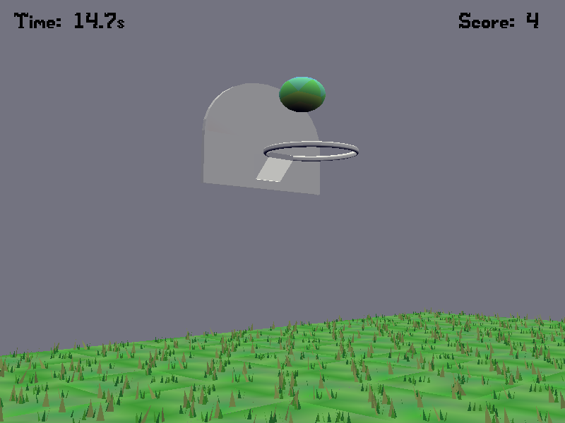

# Basketball

Author: Zihao He

Design: Play basketball on your computer! See how many points you can get in 60 seconds.

Screen Shot:

How To Play:

Just left click to aim and shoot the basketball. You will change the position after each point. Get as many points as possible in 60 seconds!

Sources:

The basketball board was found [here](https://free3d.com/3d-model/old-basketball-net-26850.html). The ball model was got from the class demo game 'Roll'. The grass model was got from the class demo 'Watch'.

This game was built with [NEST](NEST.md).
